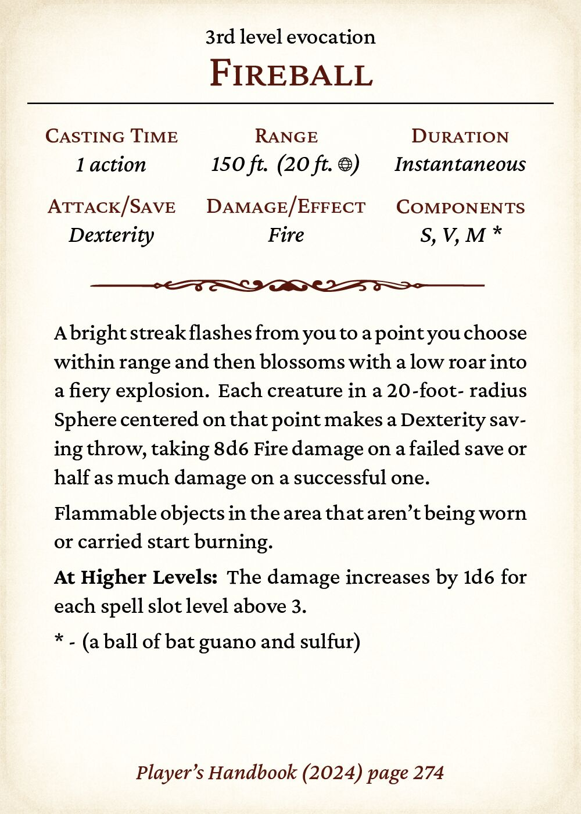

# D&D Spelldeck

While Dungeons and Dragons is great fun, it can be a chore to wade through the
Player's Handbook to find out what one of your spells does. This tool attempts
to make this easier by allowing you to create a deck of spells; a pile of cards
with all your spells and the most important information about them so you can
speed up the game.

**Note:** This project is a fork of the original work done by [Stephen Nicholas Swatman](https://github.com/stephenswat) ([@stephenswat](https://github.com/stephenswat)). The original source is available at: https://github.com/stephenswat/dnd-spelldeck

## Preview

A card looks something like this.

Some cards need to have their text truncated and the script automatically cuts text beyond a certain lenght.

## Requirements

- **LaTeX**: XeLaTeX compiler (recommended) or standard LaTeX
- **Inkscape**: Required for displaying icons on area effect spells
  - Install from [inkscape.org](https://inkscape.org/) or your package manager
  - Must be available in your system PATH
- **ImageMagick** (optional): Required only for exporting individual spell cards as images
  - Install: `brew install imagemagick` (macOS) or `sudo apt-get install imagemagick` (Linux)

## Usage
  
The first step is to create the appropriate LaTeX spell list. To do so, use the
`generate.py` program. The output of this program should be stored in a file
called `spells.tex`. By default, this selects all spells in the game so if you
want to be economical you can filter them by class, level or school. Some
examples of this:

    # This simply outputs all possible spells.
    $ ./generate.py > tex/spells.tex

    # This outputs all spells for bards and fighters
    $ ./generate.py -c bard -c fighter > tex/spells.tex

    # This outputs all spells of levels 0, 2, 5, 6 and 7
    $ ./generate.py -l 0 -l 2 -l 5-7 > tex/spells.tex

    # This outputs all warlock spells of levels 0 through 3
    $ ./generate.py -c warlock -l 0-3 > tex/spells.tex

After this is finished, use your favourite LaTeX compiler to first compile
`cards.tex` which will produce a 8.89x6.35cm page for every spell (same size as
a Magic: The Gathering card so your sleeves will work!). Then, compile
`printable.tex` which will arrange them neatly on a sheet of paper so you can
print them and then cut them to size. I like to use the following command:

    $ latexmk -xelatex -shell-escape -cd tex/cards.tex tex/printable.tex

**Note**: The `-shell-escape` flag is required for Inkscape to process SVG area effect icons.

### Quick Start with Automated Script

For a simpler workflow, use the `generate_cards.py` script which handles everything in one command:

    # Generate all spells
    $ python3 generate_cards.py

    # Generate only wizard spells of levels 1-3
    $ python3 generate_cards.py -c wizard -l 1-3

    # Generate and clean up intermediate files
    $ python3 generate_cards.py --clean

This script automatically:
1. Generates the spell LaTeX file
2. Compiles both `cards.tex` and `printable.tex`
3. Moves the final PDFs to the `pdf/` directory

### Exporting Individual Cards as Images

You can export a single spell card as an image (PNG, JPG, or SVG) using the `export_card_image.py` script:

    # Export Fireball as PNG (default, saved to samples/)
    $ python3 export_card_image.py "Fireball"

    # Export as high-resolution JPG with custom output
    $ python3 export_card_image.py "Magic Missile" -f jpg -d 600 -o my_spell.jpg

    # Keep the intermediate PDF file
    $ python3 export_card_image.py "Lightning Bolt" --keep-pdf

**Image Export Options:**
- `-f, --format`: Image format (png, jpg, svg) - default: png
- `-d, --dpi`: Resolution in DPI - default: 600
- `-o, --output`: Custom output path - default: samples/{spell_name}.{format}
- `--keep-pdf`: Keep the intermediate PDF file

**JPG Compression:** JPG exports use quality 80 with efficient encoding (4:2:0 chroma subsampling, progressive encoding) for smaller file sizes.

### Area Effect Icons

Spells with area effects will automatically display the appropriate icon next to the range text. Supported area types:
- **Cone** - Triangle icon
- **Cube** - 3D cube icon
- **Cylinder** - Cylinder icon
- **Emanation** - Radiating circle icon
- **Line** - Arrow line icon
- **Sphere** - Circle icon

This feature requires Inkscape to be installed and available in your system PATH.

### Paper sizes

The cards are currently configured to print on **US Letter** paper (8.5" x 11") with a 3x3 grid layout.

If you prefer A4 or another paper format, edit `tex/printable.tex` and change the `letterpaper` option in line 2:
- For A4: `\usepackage[a4paper,inner=1in]{geometry}`
- For other sizes: See [LaTeX geometry package documentation](https://ctan.org/pkg/geometry)

You may also need to adjust the grid layout (`nup=3x3` in line 6) to fit more or fewer cards per page.

### Fonts

The cards currently use **Crimson Pro**, a classic old-style serif font that replicates the traditional look of vintage spell cards. This font provides excellent readability and an authentic feel.

**Note:** If you prefer, you can modify the font in `tex/cards.tex`. The XeLaTeX compiler is required for custom fonts. The original template supported *Mrs Eaves* (Wizards of the Coast's Player's Handbook font), but you can substitute any font you prefer by editing the `\setmainfont` command.

## Copyright and credit

The spells text and data included in this repository are property of Wizards of the Coast. These are licensed under Open Gaming License and the LICENSE file included does *not* cover them, only
the Python and LaTeX code.

